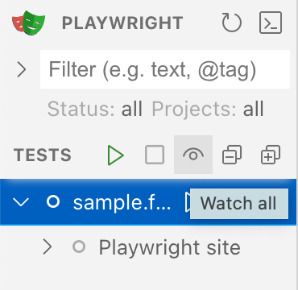

# Playwright BDD Setup

### This is a boilerplate setup based on [playwright-bdd](https://vitalets.github.io/playwright-bdd) using [Playwright](https://playwright.dev/) and [Cucumber Gherkin](https://cucumber.io/docs/gherkin/).

The feature files are located in the [`features`](./features/) folder and the step definitions are located in the [`steps`](./steps/) folder.

## Get started

1. Clone the repository and open in VSCode and install the recommended extensions.
2. Enable pnpm via node.js' [corepack](https://nodejs.org/api/corepack.html): `corepack enable pnpm`
3. Install dependencies: `pnpm i`
4. Install browsers: `pnpm playwright install chromium`

## Run tests

Run all tests via `pnpm test`

## Development

In order to start developing, you can run the tests in watch mode via `pnpm watch`. This will start [Playwright in UI Mode](https://playwright.dev/docs/test-ui-mode). The tests will re-run whenever you save a file once you enable the watch mode in the UI:

